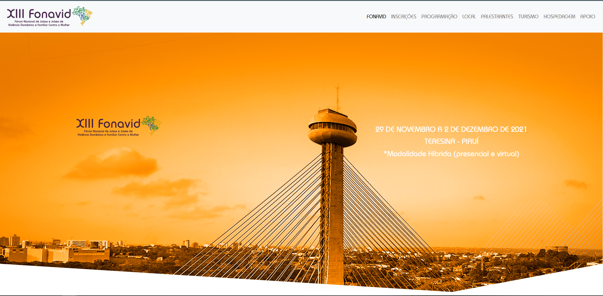

<h1 align="center"> Fonavid </h1>

Landpage do fórum nacional de juizes e juizas de violencia doméstica e familiar contra a mulher.  

  <a href="#-tecnologias">Tecnologias</a>&nbsp;&nbsp;&nbsp;|&nbsp;&nbsp;&nbsp;
  <a href="#-projeto">Projeto</a>&nbsp;&nbsp;&nbsp;&nbsp;&nbsp;&nbsp;

 

  

## 🚀 Tecnologias

Esse projeto foi desenvolvido com as seguintes tecnologias:

- HTML e CSS
- JavaScript
- Git e Github
- Figma

## 💻 Projeto

O "Fonavid" é a página de destino oficial do Fórum Nacional de Juízes e Juízas de Violência Doméstica e Familiar contra a Mulher. Este projeto tem como objetivo principal fornecer um espaço virtual dedicado à disseminação de informações, recursos e atividades relacionadas ao combate à violência doméstica e familiar no Brasil.

